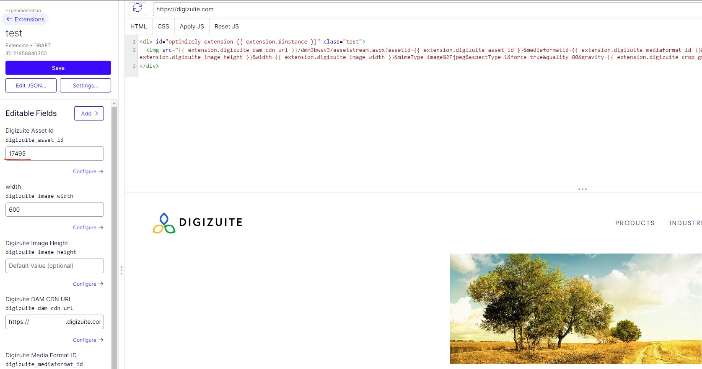
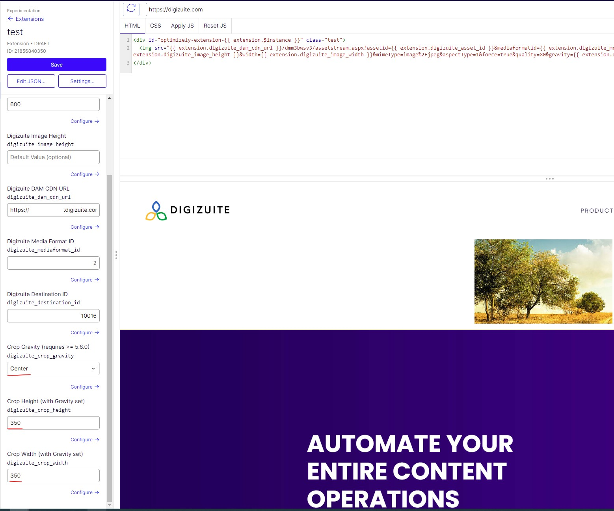

# Digizuite for Optimizely Experimentation

This project is an example of how to use Digizuite with Optimizely Experimentation. The overall guide is found in the [Digizuite Documentation](https://digizuite.atlassian.net/wiki/spaces/DD/pages/3294593025/How+to+use+Extension).

It  consists of two elements:
1. Digizuite Browser Extension based on the logic from [here](../digizuite-chrome-extension/README.md) where users can select asset ids.
2. A config.json for the actual extension logic which can imported directly into Optimizely Experimentation from its editor (Read [here](https://docs.developers.optimizely.com/web/docs/extensions)).

## Digizuite Browser Extension

For you to use the browser extension together with the Optimizely Experimentation Extension, then it is important to do one simply change but otherwise simply  follow the guide as described [here](../digizuite-chrome-extension/README.md). The important is to use the custom-embedded version of the Chrome Extension (can be used across browsers) since we need to customize one simple thing.

The thing to change is to no longer copy/paste the download URL but instead just the asset id because this is how the Optimizely Extension works. So ensure this logic where event.data.asset.assetId must be in the clipboard.writeTest statement:
Registering and reacting to users selecting assets in the Unified DAM Connector:
```
    window.addEventListener("message", (event) => {
    if(event.origin === mediaManagerUrl && event?.data?.messageType === "AssetMessage") {
        // If you need to make the asset url public, then this is where you would need to remove
        // access key and use a different destination

        // Coyping traditional download url
		    navigator.clipboard.writeText(event.data.asset.assetId).then(function() {
			  console.log('Async: Copying to clipboard was successful!');

        // Do you wish to download instead then use 
        // downloadFile(event.data.asset.downloadUrl)
		  }, function(err) {
			console.error('Async: Could not copy text: ', err);
		  });
    }
  });
```

## Optimizely Experimentation Extension

Injecting your Digizuite Images directly into an HTML Element with an Optimizely Extension.

Add the asset id to the field (either manually or using the Browser Extension for asset selection):


If you are using at least DC 5.6.0 then there is the option to focal point crop by changing the parameters seen here:


### Extension Fields

Following fields are available
1. Digizuite Asset Id
2. Digizuite DAM CDN URL
3. Digizuite Media Format ID
4. Digizuite Destination ID
5. Digizuite Image Width (optional)
6. Digizuite Image Height (optional)
7. Crop Gravity (optional)
8. Crop Width (must be used with gravity)
9. Crop Height (must be used with gravity)

## Further help

If you still have any questions please visit [Digizuite Optimizely Extension Docs](https://digizuite.atlassian.net/wiki/spaces/DD/pages/3294593025/How+to+use+Extension).